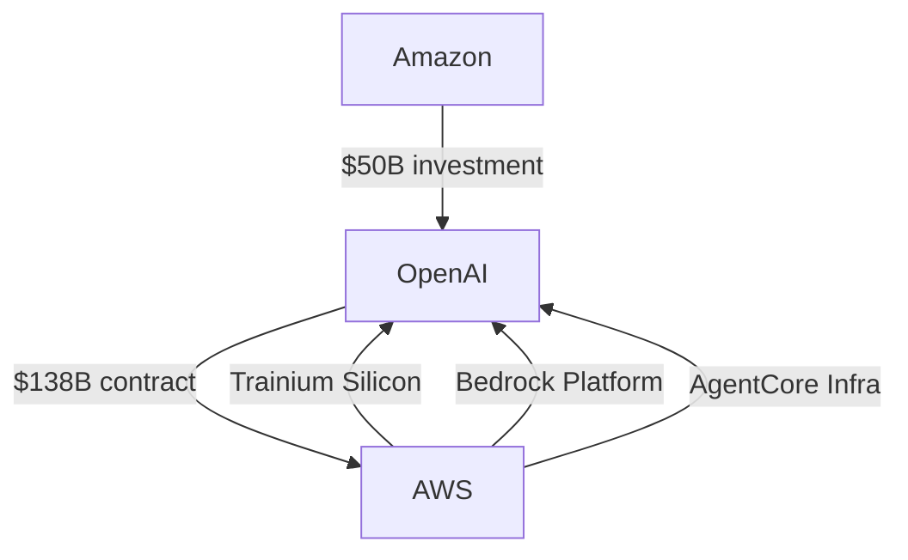

# The OpenAI-Amazon Deal

## February 2026 Announcement

- 💰 **$50B Amazon investment** in OpenAI
  - $15B upfront
  - $35B conditional on milestones (IPO/AGI)
- ☁️ **$100B AWS contract expansion**
  - Total: $138B over 8 years
- ⚡ **2 GW Trainium capacity** commitment
- 🚀 AWS becomes cloud provider for **OpenAI Frontier**

---
layout: center
class: bg-fire
---

# 🚫 Why Did OpenAI Need This?

## Stargate Stalled

The $500B joint venture with SoftBank and Oracle **failed to deliver**

---

# The Stargate Problem

## What Went Wrong

- 🤝 Three-way partnership disputes over ownership & control
- 💳 OpenAI couldn't get financing for data centers
- 🏗️ Clashed with SoftBank over Texas site
- ❌ Missed 10 GW capacity goal by end of 2025
- 👥 Venture never meaningfully staffed up

## The Solution

OpenAI did what companies do when infrastructure plans stall:

**They went to the infrastructure company**

AWS has been solving these problems for **20 years**

---
layout: center
class: bg-ocean
---

# <GradientText color="blue-green">The Deal's Real Significance</GradientText>

The company that **failed to build** a competitive AI model

just became the **infrastructure provider** for the two companies that did

🤖 **Anthropic** + 🤖 **OpenAI** = Running on AWS

