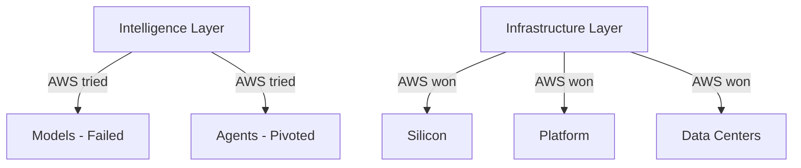

# The Infrastructure Reversion Test

## The Pattern

When a company attempts to cross the **infrastructure-intelligence boundary**, it tends to **revert to where the returns are**

AWS tried to compete **up-stack** (closer to the user):
- ❌ Failed
- ↩️ Reverted to infrastructure
- 💰 Discovered that reversion produced the revenue

---

# The Mutual Reversion

| Company | Tried To | Result |
|---------|----------|--------|
| **OpenAI** | Go down-stack into infrastructure (Stargate) | ❌ Stalled |
| **AWS** | Go up-stack into intelligence (models) | ❌ Models didn't compete |

**Neither company could cross the line**

- Infrastructure capability requires decades of institutional knowledge
- Intelligence capability requires a talent culture infrastructure companies cannot sustain

---
layout: center
class: bg-tech
---

# <GradientText color="blue-purple">The $138B Deal</GradientText>

## Two companies acknowledging the boundary

The weight of capital, talent, and contractual commitment

is flowing **toward the boundary, not across it**

