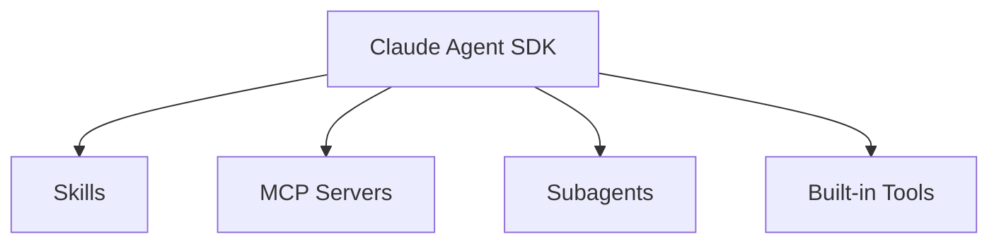

# What is Claude Agent SDK?

<div grid="~ cols-2 gap-6">
<div>

The **Claude Agent SDK** enables building multi-agent systems with:

- 🛠️ **Skills** - Reusable agent capabilities
- 🔌 **MCP Servers** - External tool integrations
- 🤖 **Subagents** - Parallel agent execution
- 🔧 **Built-in Tools** - WebSearch, Bash, Write, etc.

</div>
<div>



</div>
</div>

---
layout: center
class: bg-fire
---

# 🚫 The Problem

By default, Claude Agent SDK **requires an Anthropic API key**

What if you're already using AWS and want to leverage **Amazon Bedrock**?

---
layout: center
class: bg-ocean
---

# ✅ The Solution

## <GradientText color="blue-green">Just Two Lines of Code!</GradientText>

The SDK uses Claude Code under the hood, which supports Amazon Bedrock via environment variables

---

# The Magic Configuration

```python
import os

# Configure Claude Code to use Amazon Bedrock
os.environ["CLAUDE_CODE_USE_BEDROCK"] = "1"
os.environ["AWS_REGION"] = "us-west-2"  # Your preferred region
```

That's it! Set these **before** creating `ClaudeSDKClient`, and the SDK will use your AWS credentials instead of an Anthropic API key.

<div class="mt-8 text-center">

🎯 **No Anthropic API key needed** — uses your existing AWS credentials

</div>

