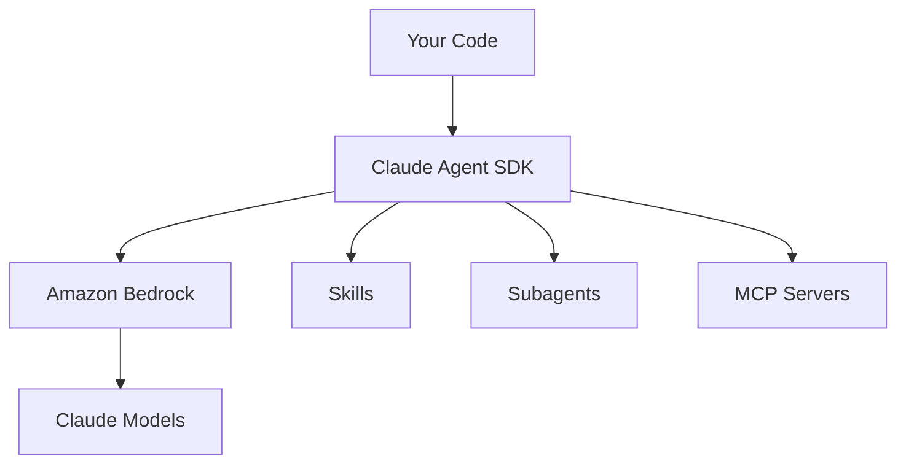

# What Works on Amazon Bedrock

## ✅ Full Feature Support

Everything from the original SDK works:

- ✅ **Skills** (e.g., `learning-a-tool`)
- ✅ **Subagents** with parallel execution
- ✅ **MCP servers** (Notion, etc.)
- ✅ **All built-in tools**
  - WebSearch
  - WebFetch
  - Bash
  - Write
  - And more...

---

# Key Takeaways

| Configuration | Value |
|---------------|-------|
| Enable Bedrock | `os.environ["CLAUDE_CODE_USE_BEDROCK"] = "1"` |
| Set region | `os.environ["AWS_REGION"] = "us-west-2"` |
| Authentication | Uses standard AWS credential chain |
| Model names | Use `"sonnet"`, `"haiku"` (SDK maps to Bedrock IDs) |

🎯 **Two environment variables** is all you need!

---
layout: center
class: bg-tech
---

# 🤖 AI-Assisted Development

This entire migration was completed through conversation with **Kiro**

No external documentation was consulted!

---

# The Kiro Workflow

## How Kiro Helped

1. 💬 Asked how to use Bedrock instead of Anthropic API
2. 🔍 Kiro checked environment, identified missing dependencies
3. ⚙️ Found correct configuration (env vars, not client params)
4. 🐛 Fixed runtime errors (MCP config validation)
5. ✅ Verified everything worked end-to-end

## Benefits

- **Real-time diagnosis** of issues
- **Suggested fixes** automatically
- **Validated setup** by running test scripts
- **No documentation diving** required

🚀 AI-assisted development accelerates debugging unfamiliar SDKs

---
layout: center
class: bg-ocean
---

# <GradientText color="blue-green">Conclusion</GradientText>

Running Claude Agent SDK on Amazon Bedrock requires **just two environment variables**

Your existing AWS credentials handle authentication

All SDK features — **Skills, Subagents, MCP Servers** — work unchanged

**If you're already in the AWS ecosystem, this is the simplest path!**

