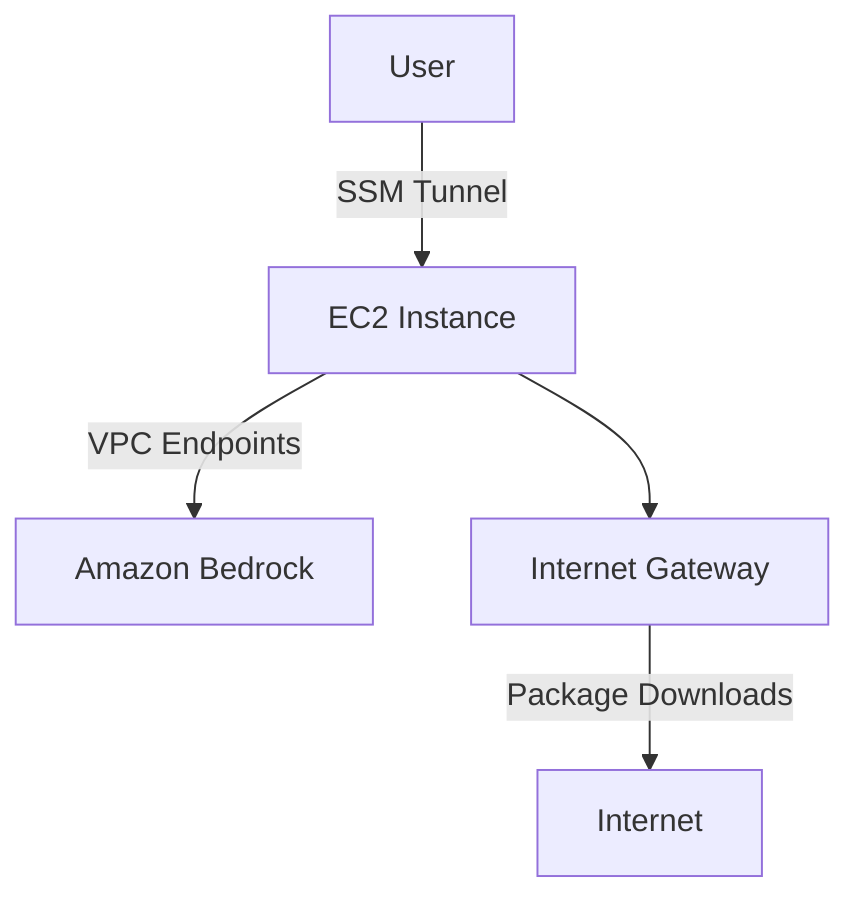

# Architecture Overview

<div grid="~ cols-2 gap-6">
<div>

## What CloudFormation Sets Up



</div>
<div>

## Key Design Decisions

- 🌐 **EC2 in public subnet** — for initial setup
- 🔒 **VPC Endpoints in private subnet** — Bedrock calls stay in AWS
- 🚫 **No inbound ports open** — SSM port forwarding only
- 💪 **Graviton (ARM) instances** — better price-performance

</div>
</div>

---

# User Access Flow

<div class="bg-[#1a1a2e] border-l-3 border-[#5dade2] p-4">

**Connect via SSM Session Manager** to establish a secure tunnel

Forward local `localhost:18789` to the EC2 instance — **no inbound ports required**

</div>

```bash
# Start the tunnel
aws ssm start-session \
  --target $INSTANCE_ID \
  --document-name AWS-StartPortForwardingSession \
  --parameters '{"portNumber":["18789"],"localPortNumber":["18789"]}'
```

Then open: `http://localhost:18789/?token=<your-token>`

---

# Prerequisites

<div grid="~ cols-3 gap-4">
<div class="bg-[#1a1a2e] border-l-3 border-[#FF9900] p-4">

## AWS Account

- Billing enabled
- IAM permissions for:
  - CloudFormation
  - EC2
  - IAM
  - VPC

</div>
<div class="bg-[#1a1a2e] border-l-3 border-[#5dade2] p-4">

## AWS CLI v2

Install from AWS docs

```bash
aws --version
```

</div>
<div class="bg-[#1a1a2e] border-l-3 border-[#00d4aa] p-4">

## SSM Plugin

Session Manager Plugin

Required for port forwarding

</div>
</div>

<div class="mt-6 text-center">

📦 **Template**: `github.com/hanyun2019/openclaw-on-aws`

</div>

