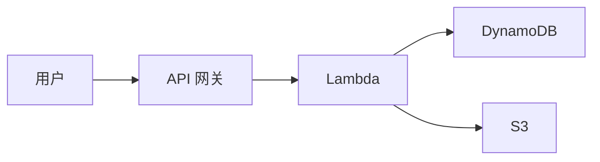

# 内容功能

本章演示代码、表格、图表等内容能力。

---

# 代码高亮

Slidev 支持漂亮的代码高亮：

```typescript
interface User {
  id: number
  name: string
  email: string
}

async function fetchUser(id: number): Promise<User> {
  const response = await fetch(`/api/users/${id}`)
  return response.json()
}
```

支持多种语言的语法高亮。

---
layout: center
---

# <GradientText color="blue-purple">居中布局</GradientText>

适合做<GradientText color="blue-green">章节过渡</GradientText>或<GradientText color="orange-pink">重点强调</GradientText>

内容水平垂直双向居中

用 GradientText 组件<GradientText color="blue-purple">突出关键词</GradientText>

---

# 表格

完整支持 Markdown 表格：

| 功能 | 本主题 | 默认主题 |
|------|---------|---------|
| 深色模式 | ✅ | ❌ |
| 渐变背景 | ✅ | ❌ |
| 品牌色彩 | ✅ | ❌ |
| 代码高亮 | ✅ | ✅ |
| 图表支持 | ✅ | ✅ |

---

# Mermaid 图表



Mermaid 图表在深色背景下使用主题蓝色的线条，中文节点名也会用合适的中文字体。

用 `{scale: 0.8}` 控制缩放。

---

# 数学公式

行内公式：$E = mc^2$

块级公式：

$
\frac{d}{dx}\left( \int_{0}^{x} f(u)\,du\right)=f(x)
$

完整 LaTeX 支持。

---

# 图标

emoji 最方便：🚀 ✅ ❌ 💡 📊 🔧

也可以用 Iconify 图标：

<carbon:arrow-right /> 向右箭头

<carbon:checkmark /> 完成标记

---
layout: center
---

# 更多资源

[Amazon Web Services 中文文档](https://aws.amazon.com/cn/documentation/)

[Slidev 文档](https://sli.dev)
