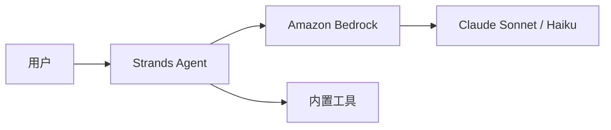

# 自定义组件

深色主题内置了三个 Vue 组件和一套 Mermaid 架构模板，无需 import，直接使用。

---

# StatCard — 数据亮点

用 `<StatCard>` 突出单个关键数字。

<div class="flex flex-wrap gap-6 mt-6">
  <StatCard value="$2000亿" label="2026 年资本开支" trend="up" color="orange" />
  <StatCard value="140万" label="Q4 部署的 Trainium2 芯片" color="blue" />
  <StatCard value="3万人" label="企业裁员" trend="down" color="green">
    公司史上最大规模
  </StatCard>
  <StatCard value="4.3%" label="YC 创业公司使用 Bedrock" color="purple" />
</div>

---

# StatCard — 用法

```md
<StatCard
  value="$2000亿"
  label="2026 年资本开支"
  trend="up"
  color="orange"
/>

<StatCard value="3万人" label="企业裁员" color="green">
  公司史上最大规模
</StatCard>
```

**Props：**

- `value` — 主数据
- `label` — 简短说明
- `trend` — `up` | `down` | `neutral`（可选）
- `color` — `blue` | `orange` | `green` | `purple`（默认 blue）

---

# Timeline — 时间线

<Timeline>
  <TimelineItem date="2015" title="收购 Annapurna Labs">
    以约 3.5 亿美元收购以色列芯片设计公司。
  </TimelineItem>
  <TimelineItem date="2019" title="Inferentia 发布">
    第一代推理芯片。
  </TimelineItem>
  <TimelineItem date="2022" title="Trainium 发布">
    第一代训练芯片。
  </TimelineItem>
  <TimelineItem date="2025" title="Project Rainier 上线" highlight>
    为 Anthropic 部署 50 万块 Trainium2。
  </TimelineItem>
  <TimelineItem date="2026" title="OpenAI 1380 亿美元合约">
    2 GW 的 Trainium3 / Trainium4 承诺。
  </TimelineItem>
</Timeline>

---

# ComparisonTable — 并排对比

<ComparisonTable
  leftTitle="自助式 Trainium"
  rightTitle="专用 Trainium"
  leftAccent="red"
  rightAccent="green"
>
<template #left>

- Neuron SDK 门槛高
- 开发体验不佳
- SageMaker 容器更新滞后
- 自助用户采用率低

</template>
<template #right>

- 与前沿实验室共同开发
- Anthropic 超过 100 万块 Trainium2
- 100 亿美元以上年化收入
- 三位数同比增长

</template>
</ComparisonTable>

---

# 架构模板（Mermaid）

主题在 `theme-aws-dark/snippets/architectures/` 目录下提供了即用的 Mermaid 架构模板：

| 模板 | 场景 |
|------|------|
| `aws-basic-web.md` | CloudFront → ALB → ECS → RDS |
| `aws-serverless.md` | API Gateway → Lambda → DynamoDB |
| `aws-ai-agent-simple.md` | Strands Agent → Bedrock |
| `aws-ai-agent-production.md` | + AgentCore + MCP + 可观测性 |
| `aws-data-pipeline.md` | S3 → Glue → Athena → QuickSight |

把 Mermaid 代码块复制到幻灯片里，改一下节点名就能用。

---

# 示例：AI Agent 基础版



来自 `snippets/architectures/aws-ai-agent-simple.md`。
