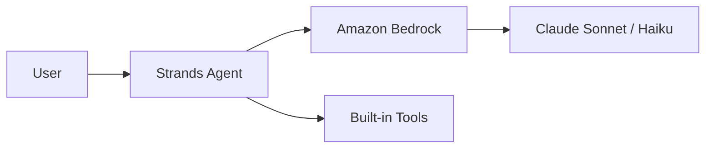

# Custom Components

The AWS Dark theme ships with three purpose-built Vue components and a set of
Mermaid architecture snippets. No import needed — they are globally registered.

---

# StatCard — Spotlight Metrics

Use `<StatCard>` to highlight a single number.

<div class="flex flex-wrap gap-6 mt-6">
  <StatCard value="$200B" label="2026 capex plan" trend="up" color="orange" />
  <StatCard value="1.4M" label="Trainium2 chips deployed in Q4" color="blue" />
  <StatCard value="30K" label="Corporate layoffs" trend="down" color="green">
    Largest in company history
  </StatCard>
  <StatCard value="4.3%" label="YC startups using Bedrock" color="purple" />
</div>

---

# StatCard — Syntax

```md
<StatCard
  value="$200B"
  label="2026 capex plan"
  trend="up"
  color="orange"
/>

<StatCard value="30K" label="Layoffs" color="green">
  Largest in company history
</StatCard>
```

**Props:**

- `value` — the big number
- `label` — short description
- `trend` — `up` | `down` | `neutral` (optional)
- `color` — `blue` | `orange` | `green` | `purple` (default: blue)

---

# Timeline — Sequential Events

<Timeline>
  <TimelineItem date="2015" title="Annapurna Labs acquired">
    ~$350M for custom silicon design.
  </TimelineItem>
  <TimelineItem date="2019" title="Inferentia launched">
    First-gen inference chip.
  </TimelineItem>
  <TimelineItem date="2022" title="Trainium launched">
    First-gen training chip.
  </TimelineItem>
  <TimelineItem date="2025" title="Project Rainier online" highlight>
    500,000 Trainium2 chips for Anthropic.
  </TimelineItem>
  <TimelineItem date="2026" title="OpenAI $138B deal">
    2 GW Trainium3 / Trainium4 commitment.
  </TimelineItem>
</Timeline>

---

# Timeline — Syntax

```md
<Timeline>
  <TimelineItem date="2015" title="Annapurna Labs acquired">
    ~$350M for custom silicon design.
  </TimelineItem>
  <TimelineItem date="2025" title="Project Rainier online" highlight>
    500,000 Trainium2 chips for Anthropic.
  </TimelineItem>
</Timeline>
```

**TimelineItem props:**

- `date` — left-side label
- `title` — event headline
- `highlight` — render node in AWS orange (marks the critical event)

---

# ComparisonTable — Side-by-Side

<ComparisonTable
  leftTitle="Self-service Trainium"
  rightTitle="Dedicated Trainium"
  leftAccent="red"
  rightAccent="green"
>
<template #left>

- Alien Neuron SDK
- Poor developer experience
- SageMaker container delays
- Low self-service adoption

</template>
<template #right>

- Co-developed with frontier labs
- 1M+ Trainium2 chips at Anthropic
- $10B+ annual run rate
- Triple-digit YoY growth

</template>
</ComparisonTable>

---

# ComparisonTable — Syntax

```md
<ComparisonTable
  leftTitle="Self-service"
  rightTitle="Dedicated"
  leftAccent="red"
  rightAccent="green"
>
<template #left>

- Item 1
- Item 2

</template>
<template #right>

- Item 1
- Item 2

</template>
</ComparisonTable>
```

**Accent colors:** `blue` · `orange` · `green` · `purple` · `red`

---

# Architecture Snippets (Mermaid)

The theme ships with ready-to-use Mermaid architecture templates in
`theme-aws-dark/snippets/architectures/`:

| Template | Scenario |
|----------|----------|
| `aws-basic-web.md` | CloudFront → ALB → ECS → RDS |
| `aws-serverless.md` | API Gateway → Lambda → DynamoDB |
| `aws-ai-agent-simple.md` | Strands Agent → Bedrock |
| `aws-ai-agent-production.md` | + AgentCore + MCP + Observability |
| `aws-data-pipeline.md` | S3 → Glue → Athena → QuickSight |

Just copy the Mermaid block into your slide and adjust node names.

---

# Example: AI Agent Simple



From `snippets/architectures/aws-ai-agent-simple.md`.
