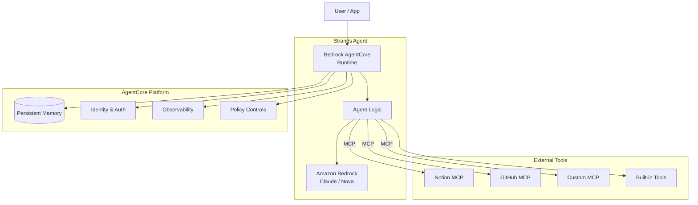
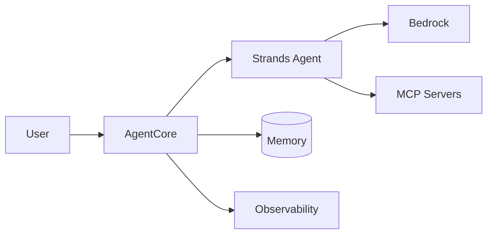

# AI Agent — Production (Strands + AgentCore + MCP)

Production-grade AI agent. Adds Bedrock AgentCore for runtime isolation,
persistent memory, identity management, and observability. Integrates MCP
servers for external tool access.

## Full Architecture



## Simplified (key services only)



## AgentCore Capabilities

| Layer | What it provides |
|-------|------------------|
| **Runtime** | Isolated agent execution, auto-scaling |
| **Memory** | Session-persistent + long-term memory stores |
| **Identity** | Per-user auth, credential management |
| **Observability** | Traces, logs, token usage per session |
| **Policy** | Guardrails, content filtering, usage limits |
| **Tool Gateway** | Unified interface to MCP and built-in tools |

## Code Sketch

```python
from strands import Agent
from strands.runtime import AgentCoreRuntime
from strands.mcp import MCPServer

agent = Agent(
    model="us.anthropic.claude-opus-4-6-v1",
    mcp_servers=[
        MCPServer.notion(token=os.environ["NOTION_TOKEN"]),
        MCPServer.github(token=os.environ["GITHUB_TOKEN"]),
    ],
)

# Deploy to AgentCore for managed runtime, memory, observability
runtime = AgentCoreRuntime(agent=agent, session_id=user_id)
result = runtime.run("Research our Q4 roadmap and draft a summary")
```

## When to pick this

- Multi-tenant enterprise deployments
- Agents that need persistent memory across sessions
- Regulated workloads requiring audit trails and policy enforcement
- Integrating with multiple external systems via MCP
- Scaling beyond a single user or single machine
