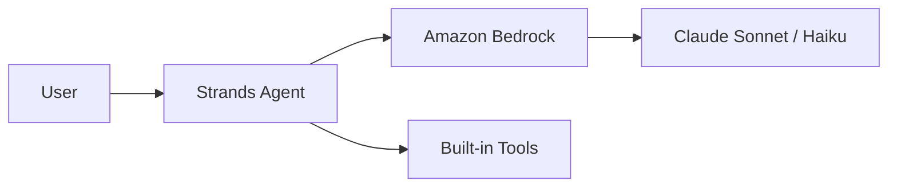
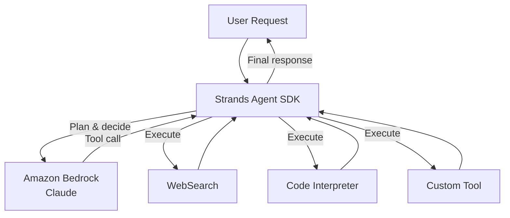

# AI Agent — Simple (Strands + Bedrock)

Minimum viable AI agent. Uses the open-source Strands Agents SDK to orchestrate
tool calls against Claude on Amazon Bedrock.

## Linear Flow



## With Tool Loop



## Code Sketch

```python
from strands import Agent
from strands.tools import web_search, code_interpreter

agent = Agent(
    model="us.anthropic.claude-sonnet-4-6-v1",
    tools=[web_search, code_interpreter],
)

result = agent.run("Summarize the latest AWS Bedrock release notes")
```

## When to pick this

- Prototyping or small-scale agent workflows
- No long-running sessions or persistent memory needed
- Running locally or on a single server
- Want the simplest possible Strands + Bedrock integration

## Next step

For production workloads with multi-session state, identity, and observability,
see [aws-ai-agent-production.md](./aws-ai-agent-production.md).
