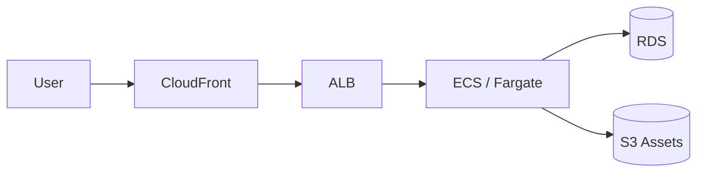
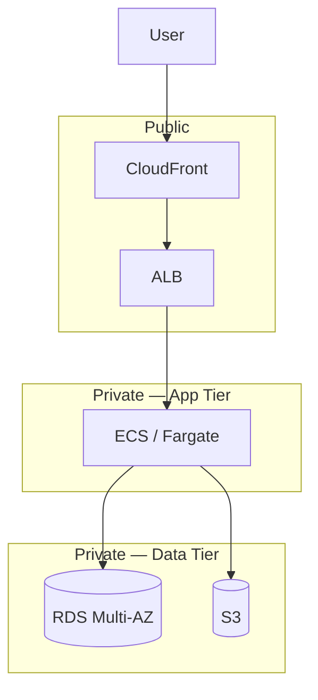

# Basic 3-Tier Web Architecture

Classic AWS web app: edge caching, load-balanced compute, managed database.

## Simple (Linear Flow)

## Grouped (with VPC tiers)

## Variations to try

- Swap `ECS` for `EC2 ASG` or `App Runner`
- Swap `RDS` for `Aurora` / `DynamoDB`
- Add `WAF` in front of `CloudFront`
- Add `ElastiCache` between `ECS` and `RDS`
