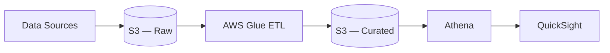
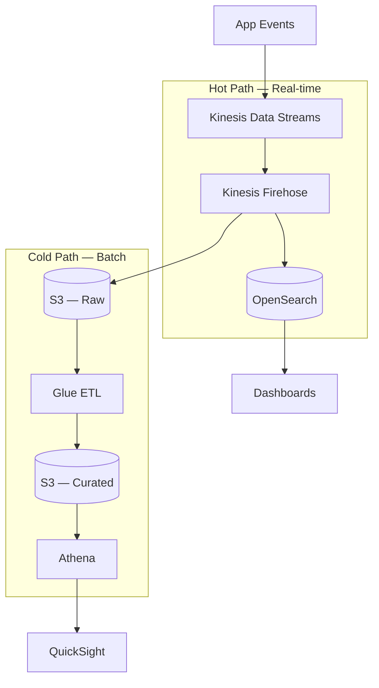
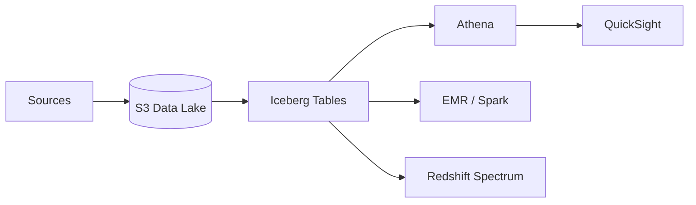

# Analytics Data Pipeline

Ingest raw data, transform with Glue, query ad-hoc with Athena, visualize with QuickSight.

## Batch Pipeline

## Streaming + Batch (Lambda Architecture style)

## Modern Lakehouse (Iceberg)

## When to pick this

- Centralizing data from multiple sources into S3 as the source of truth
- Ad-hoc SQL queries without managing a data warehouse
- Schema-on-read workflows (JSON, Parquet, CSV)
- Need to combine real-time and historical analytics
