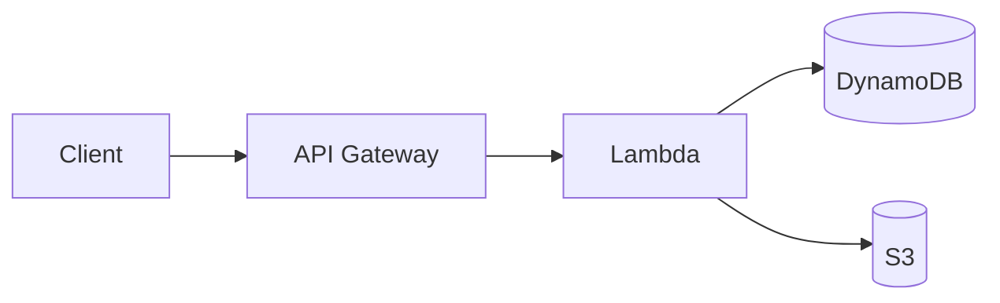
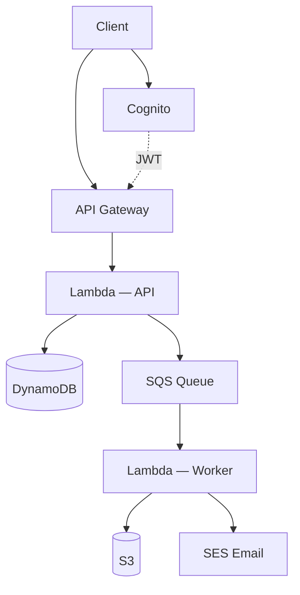
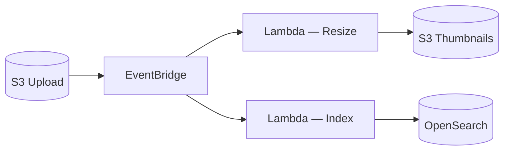

# Serverless API Architecture

Pay-per-invocation, zero idle cost. Ideal for event-driven workloads and APIs.

## REST API

## With Auth & Async Processing

## Event-Driven (EventBridge)

## When to pick this

- Unpredictable or spiky traffic
- Short-lived request handling (under 15 minutes)
- Want to avoid managing servers or containers
- Event-driven integrations between AWS services
